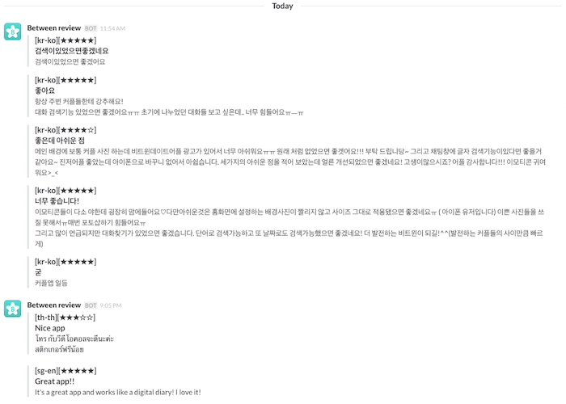

# Clerk

Clerk은 사용자의 리뷰들을 기록하고 전달합니다.

사용자 리뷰에는 각 나라 또는 각 스토어에서 일어나는 다양한 버그와 UX 문제 정보가 시공간을 넘어 담겨 있습니다
Clerk는 가장 귀중한 원석과 같은 정보를 다듬고 광내어 여러분께 전달해 드립니다.

원석을 더 빠르게 더 쉽게 받기 위해 clerk은 각 store 및 market을 감시하고 slack으로 통보하는 어플리케이션 입니다.

## Demo

## Install and run

1. Install [Python3](http://python.org) and [lxml](http://lxml.de/installation.html)
2. Insall python libraries ("pip install -r requirements.txt")
3. Create setting file.(Sample file is settings.py.sample)
4. Run job.py ("python job.py" or "nohup python -u ./job.py > job.log &")
